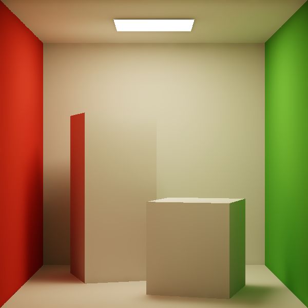
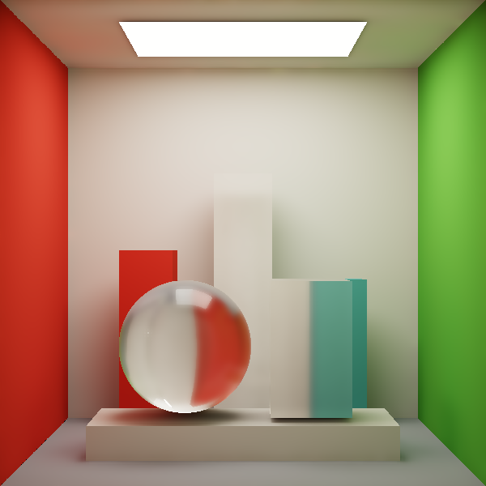
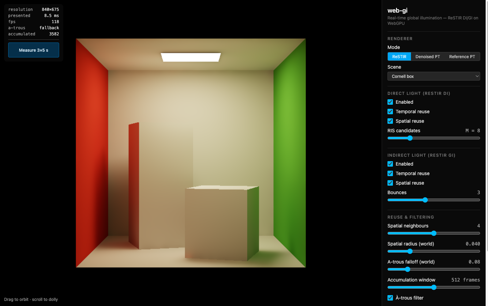

# web-gi

[](https://github.com/nemolize/web-gi/actions/workflows/ci.yml)
[](https://github.com/nemolize/web-gi/actions/workflows/deploy.yml)
[](LICENSE)

Real-time global illumination in the browser. Direct and indirect lighting are
both resolved with **ReSTIR** (Reservoir-based Spatio-Temporal Importance
Resampling) on WebGPU compute shaders, with a brute-force path tracer alongside
as the ground-truth reference.

**▶ [Try it live](https://web-gi.nemolize.workers.dev)** — no install, just a
browser with WebGPU (recent Chrome, Edge, or Safari). The page reports the
reason if the API or an adapter is unavailable.

[](https://web-gi.nemolize.workers.dev)

<sub>Cornell box, ReSTIR DI + GI. Colour bleeding from the red and green walls,
soft shadows, and multi-bounce indirect light — all resolved in real time.</sub>

## Features

- **ReSTIR DI** — `M` light samples per pixel resampled with RIS, then combined
  with the reprojected reservoir from the previous frame and with reservoirs
  from neighbouring pixels. Visibility is excluded from the RIS target function
  and applied once, on the surviving sample, at shading time.
- **ReSTIR GI** — one indirect bounce per pixel produces a _sample point_
  carrying the radiance it reflects towards the visible point, reused temporally
  and spatially through the reconnection Jacobian, with a visibility ray
  guarding against light leaking between reused pixels.
- **Denoised path tracer** — one path sample per visible surface, accumulated
  temporally and filtered by the same à-trous chain. This is the equal-time
  comparison path: cheaper frames buy more independent samples, while the filter
  sees the same albedo-demodulated illumination representation.
- **Reference path tracer** — no resampling, no denoiser, one path per pixel per
  frame progressively averaged. Use it to check what ReSTIR converges towards.
- **Every stage is an independent toggle** — DI/GI, temporal reuse, spatial
  reuse, the à-trous filter. The contribution of each part is visible on its own.
- **Analytic dielectrics** — the glass scene adds a sphere and two clear cuboids
  with Fresnel reflection, refraction, total internal reflection, and subtle
  transmission tints.

[](https://web-gi.nemolize.workers.dev)

<sub>Glass scene: refraction through analytic dielectrics, with the red wall
inverted through the sphere.</sub>

## Controls

[](https://web-gi.nemolize.workers.dev)

<sub>The overlay reports resolution, frame time and how many frames have
accumulated; the panel holds the per-stage toggles and sliders.</sub>

- **Drag** to orbit, **scroll** to dolly.
- The panel exposes RIS candidate count, spatial neighbour count and radius, GI
  bounce depth, accumulation window, resolution scale, and exposure.
- The room is a closed box; primary rays cull back-facing surfaces, so the near
  wall becomes a cutaway and the interior stays visible from any angle.

## Scenes

Six scenes are staged in the same unit-cube room, all primarily Lambertian so
diffuse interreflection stays the core of the image:

| Scene                      | What it is for                                                                                |
| -------------------------- | --------------------------------------------------------------------------------------------- |
| **Cornell box**            | The classic single ceiling emitter and two blocks                                             |
| **Glass sphere & cuboids** | Three clear analytic dielectrics with reflected and refracted room detail                     |
| **30 lights**              | A grid of tinted emitters, where DI resampling has more to work with                          |
| **Two rooms**              | A partition with one doorway: the near half is lit only through the opening and by bounce     |
| **Cove light**             | An upward-facing emitter behind a lip: the room below it is lit by the bounce off the ceiling |
| **Pillars**                | Nine pillars under a broad emitter — overlapping penumbrae and contact regions                |

## Running locally

Toolchain versions are pinned in `mise.toml` ([mise](https://mise.jdx.dev/)
provisions them with `mise install`).

```bash
pnpm install
pnpm dev
```

`pnpm run` lists the rest — build, test, `test:e2e`, lint and fix.

Two things the script names do not tell you:

- `E2E_PREVIEW=1 pnpm run test:e2e` builds first and runs against `vite preview`
  instead of the dev server. That is what CI does, and the only way to exercise
  Worker asset serving and the hashed production bundle locally.
- Development builds add an in-page renderer comparison to the stats overlay and
  expose `window.__gi` for scripted experiments — see
  [manual comparison](docs/benchmarking.md#manual-comparison-in-development-builds).
  WGSL compile errors reach the console with the shader name and `line:column`;
  without that they surface only as invalid-pipeline warnings at dispatch time.

## Deployment

`main` deploys to Cloudflare Workers; pull requests upload a preview version and
post its URL as a sticky comment. The conditions live in
`.github/workflows/deploy.yml`.

One rule there is worth stating because the workflow cannot explain itself: fork
and Dependabot pull requests are **deliberately** skipped rather than broken.
Neither can read the Cloudflare token, so a deploy step would fail on every such
PR; skipping keeps that signal honest.

## Technical details

- [Pipeline and architecture](docs/architecture.md) — the per-frame pass order,
  scene representation, and accumulation behaviour.
- [Benchmark methodology](docs/benchmarking.md) — the equal-time comparison
  presets, how a verdict is decided, and why the tie threshold is provisional.
- [Spatial reuse is bounded in world units](docs/spatial-reuse.md) — a unit
  mismatch that let reuse reach across the room, and the fix.

## Known limitations

- The `M`-weighted reuse combination is **biased**, and the visibility test that
  rejects GI candidates is not reflected in the 1/Z normalisation. The measured
  residual sits well under a percent of luminance in either direction — see
  [Known bias](docs/architecture.md#known-bias).
- ReSTIR reservoirs are restricted to **diffuse vertices**. Glass is evaluated
  as delta paths at shading time and never stored in a reservoir.
- **Which renderer wins depends on the condition, so any claim about it has to
  name one** — see the [recorded runs](docs/benchmarking.md#how-a-verdict-is-decided).
- The à-trous filter ships as a texture-backed pass. A workgroup-tiled variant
  exists behind `?atrous=tiled`, but it measured slower on the device it was
  written for and needs more workgroup storage than WebGPU guarantees, so it
  stays an opt-in experiment rather than the default.

## References

- Bitterli et al., _Spatiotemporal reservoir resampling for real-time ray tracing with dynamic direct lighting_, SIGGRAPH 2020
- Ouyang et al., _ReSTIR GI: Path Resampling for Real-Time Path Tracing_, HPG 2021
- Schied et al., _Spatiotemporal Variance-Guided Filtering_, HPG 2017

## License

MIT
