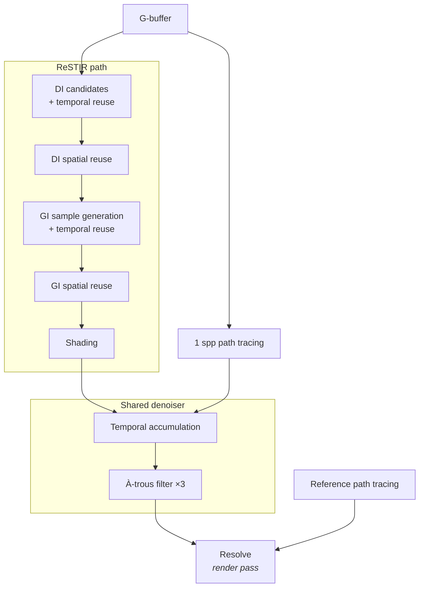

# Pipeline and architecture

One frame, in **dispatch order** (`src/gi/renderer.ts`). Arrows are the order
passes are encoded in, not a data-dependency graph — every pass reads the
G-buffer, and shading reads both the DI and the GI reservoir.

The selected mode picks one of three routes. ReSTIR and the path tracer share
the denoiser; the reference renderer bypasses everything and presents directly.

Every pass above is a compute shader under `src/gi/shaders/` with
`common.wgsl` and `scene.wgsl` prepended, so group 0 is identical across them
and one explicit bind group layout is reused. The exception is the resolve,
which is a **render** pass (`present.wgsl`, `common.wgsl` only) with its own
group 0 — it tone-maps the filtered illumination into the swap-chain.

## Accumulation and camera motion

Diffuse irradiance does not depend on the eye, so ReSTIR and the denoised path
tracer normally keep their history across camera motion and drop it only on
disocclusion. Reference rendering and glass scenes restart accumulation because
their full reflected and refracted radiance is view-dependent.

## Scene representation

The scene is a small set of parallelograms with perpendicular edges plus
optional analytic glass spheres and boxes. Quad intersections invert the
barycentric solve with two dot products and skip the need for any acceleration
structure. The closed room provides another shortcut: it is the convex hull of
everything in it, so a shadow ray — always a segment between two points on its
interior surfaces — can never reach a wall. So the walls are sorted last and
occlusion queries stop before them.

**That shortcut is an invariant, not an optimisation detail**: adding geometry
outside the room, or making the room concave, silently breaks shadow rays. Unit
tests guard it, and separately the struct packing offsets that have to agree
with the WGSL layout by hand.

## Known bias

The reuse passes use the `M`-weighted combination (Bitterli et al. 2020,
Algorithm 4) with the 1/Z correction for spatial reuse, and clamp the temporal
history length. That combination is biased, and the visibility test used to
reject GI candidates is not reflected in the 1/Z normalisation.

A `compareLinear` sweep across both scenes, three camera positions, and every
combination of spatial-neighbour count and bounce depth put the residual well
under a percent of luminance, in either direction — it is not consistently dark.
Run one to see the figures for a given build rather than trusting this sentence.

ReSTIR reservoirs remain restricted to diffuse vertices. Glass shapes are
evaluated as delta paths in the shading pass and are never stored in a reservoir
for spatial or temporal reconnection.
