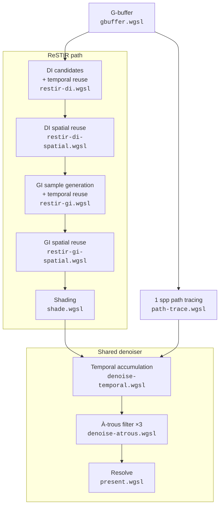

# Pipeline and architecture

One frame, in dispatch order (`src/gi/renderer.ts`). The two shading paths are
alternatives: ReSTIR resamples reservoirs, the path tracer draws one sample per
visible surface, and both hand the same albedo-demodulated illumination to the
shared denoiser.

| Pass                                  | File                             | Output                          |
| ------------------------------------- | -------------------------------- | ------------------------------- |
| G-buffer                              | `shaders/gbuffer.wgsl`           | depth, normal, albedo, emission |
| DI candidates + temporal reuse        | `shaders/restir-di.wgsl`         | DI reservoir                    |
| DI spatial reuse                      | `shaders/restir-di-spatial.wgsl` | DI reservoir                    |
| GI sample generation + temporal reuse | `shaders/restir-gi.wgsl`         | GI reservoir                    |
| GI spatial reuse                      | `shaders/restir-gi-spatial.wgsl` | GI reservoir                    |
| Shading                               | `shaders/shade.wgsl`             | albedo-demodulated illumination |
| 1 spp path tracing (alternative)      | `shaders/path-trace.wgsl`        | albedo-demodulated illumination |
| Temporal accumulation                 | `shaders/denoise-temporal.wgsl`  | accumulated illumination        |
| À-trous filter (×3)                   | `shaders/denoise-atrous.wgsl`    | filtered illumination           |
| Resolve                               | `shaders/present.wgsl`           | tone-mapped frame               |

`shaders/common.wgsl` holds the data layouts, RNG, sampling and reservoir
helpers; `shaders/scene.wgsl` holds the bindings, ray tracing and light
sampling. Both are prepended to every compute shader, so group 0 is identical
across passes and one explicit bind group layout is reused.

## Accumulation and camera motion

Diffuse irradiance does not depend on the eye, so ReSTIR and the denoised path
tracer normally keep their history across camera motion and drop it only on
disocclusion. Reference rendering and glass scenes restart accumulation because
their full reflected and refracted radiance is view-dependent.

## Scene representation

The scene is a small set of parallelograms with perpendicular edges plus
optional analytic glass spheres and boxes. Quad intersections invert the
barycentric solve with two dot products and skip the need for any acceleration
structure. The closed room provides another shortcut: it is the convex hull of
everything in it, so a shadow ray — always a segment between two points on its
interior surfaces — can never reach a wall. `buildScene` sorts the walls last
and occlusion queries stop before them. Adding geometry outside the room, or
making the room concave, breaks that and is what
`shadow-ray-occluders.test.ts` guards. `src/gi/scene.ts` builds it and packs it for the
GPU; the unit tests check the packing offsets against the WGSL struct layout and
the camera maths against its shader counterpart.

## Known bias

The reuse passes use the `M`-weighted combination (Bitterli et al. 2020,
Algorithm 4) with the 1/Z correction for spatial reuse, and clamp the temporal
history length. That combination is biased, and the visibility test used to
reject GI candidates is not reflected in the 1/Z normalisation.

A `compareLinear` sweep across both scenes, three camera positions, and every
combination of spatial-neighbour count and bounce depth put the residual well
under a percent of luminance, in either direction — it is not consistently dark.
Run one to see the figures for a given build rather than trusting this sentence.

ReSTIR reservoirs remain restricted to diffuse vertices. Glass shapes are
evaluated as delta paths in the shading pass and are never stored in a reservoir
for spatial or temporal reconnection.

## Deployment

Deployment is handled by `.github/workflows/deploy.yml`:

- Push to `main` deploys to production (`wrangler deploy`).
- A manual run from `main` redeploys production; manual runs from other refs upload a preview version instead.
- Pull requests upload a preview version (`wrangler versions upload`); the preview URL is posted as a sticky PR comment.
- Fork pull requests and Dependabot pull requests are skipped — neither can read the workflow's Cloudflare token.

The Worker configuration lives in `wrangler.json`. The build is driven by
`@cloudflare/vite-plugin`, which generates the deployable config under `dist/`
during `pnpm build`.
